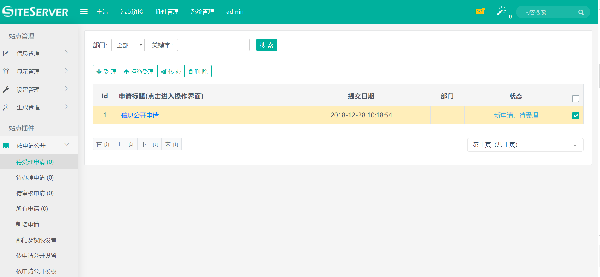
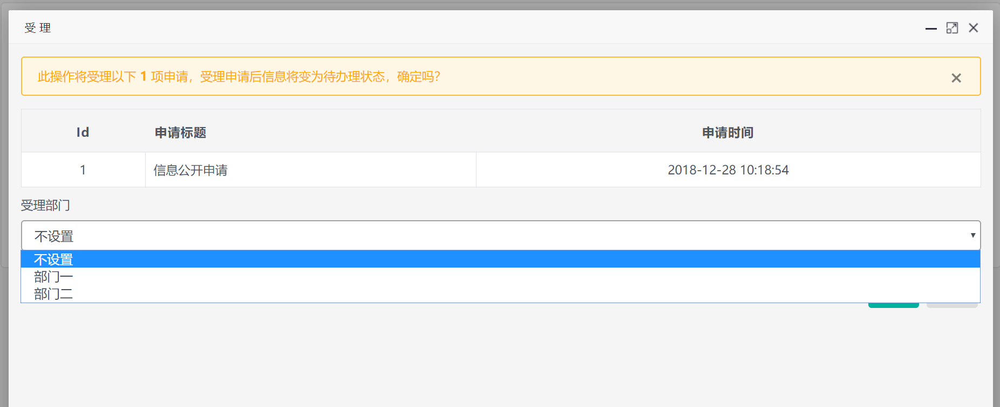
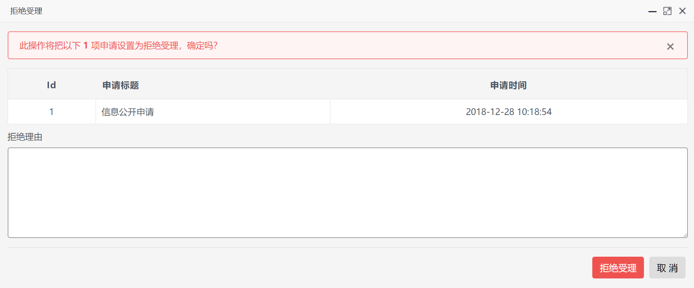

# 受理信件

进入互动交流插件，点击待受理信件菜单，出现受理信件界面：

管理员可以在这里选择具体的信件进行`受理`或者`拒绝受理`操作。

## 受理操作

选择需要受理的信件后点击受理按钮，系统将弹出受理信件界面：

在此，管理员可以选择受理部门。

管理员`受理`信件后，信件将进入`已受理，代办理`状态。

## 拒绝受理操作

选择信件后点击拒绝受理按钮，系统将弹出拒绝受理信件界面：

拒绝受理必须填写拒绝理由，用户在前台页面查询信件结果时将显示填写的拒绝理由。

管理员`拒绝受理`信件后，信件将进入`拒绝受理`状态，至此信件处理流程已完毕。
