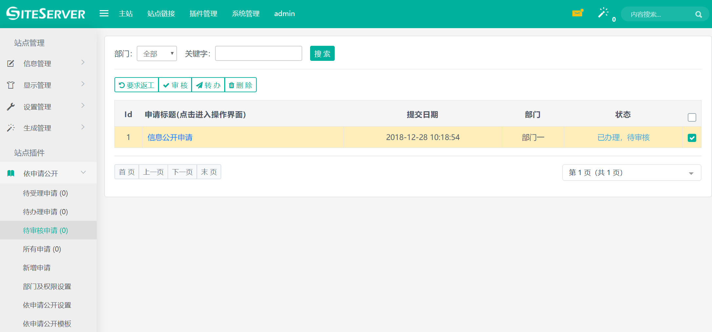
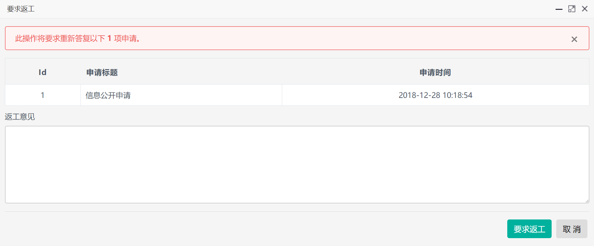
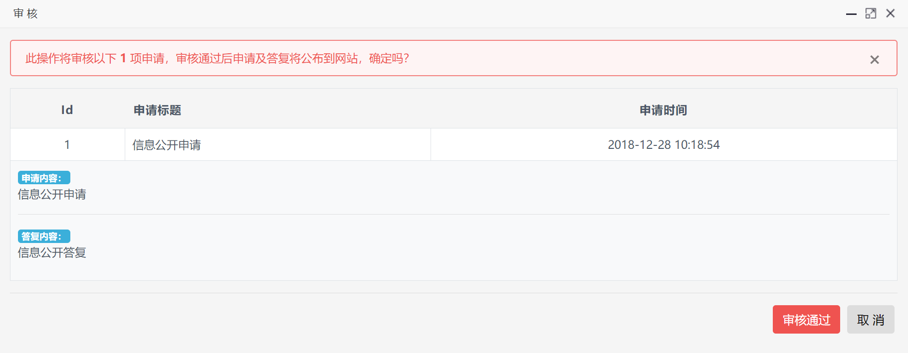

# 审核信件

进入互动交流插件，点击待审核信件菜单，出现审核信件界面：

管理员可以在这里选择具体的信件进行`要求返工`或者`审核`操作。

## 要求返工操作

选择信件后点击要求返工按钮，系统将弹出要求返工界面：

要求返工操作必须填写返工意见，确认后信件将进入`要求返工`状态，负责办理此信件的管理员需要进一步完善回复内容。

## 审核操作

选择需要审核的信件后点击审核按钮，系统将弹出审核信件界面：

管理员对信件进行`审核`操作后，信件将进入`已审核，处理完毕`状态，至此信件处理流程已完毕，前台用户可以通过信件查询号查询到办理结果。
