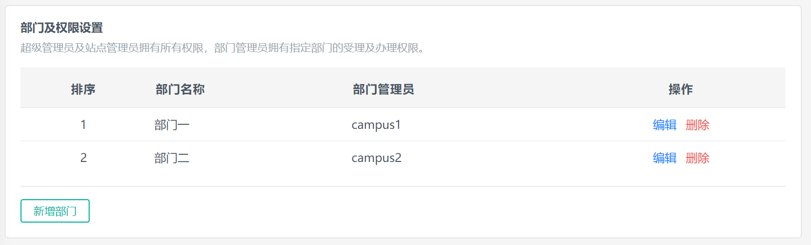
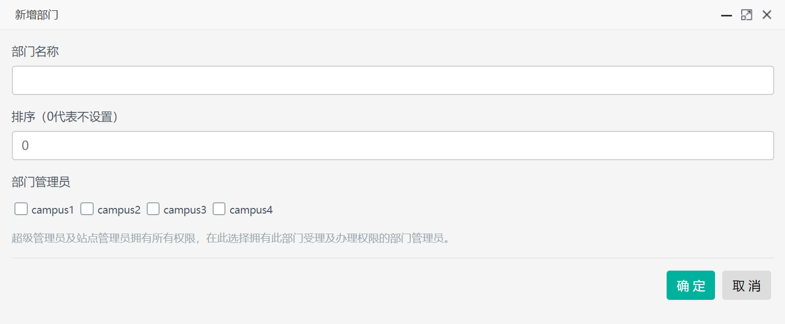
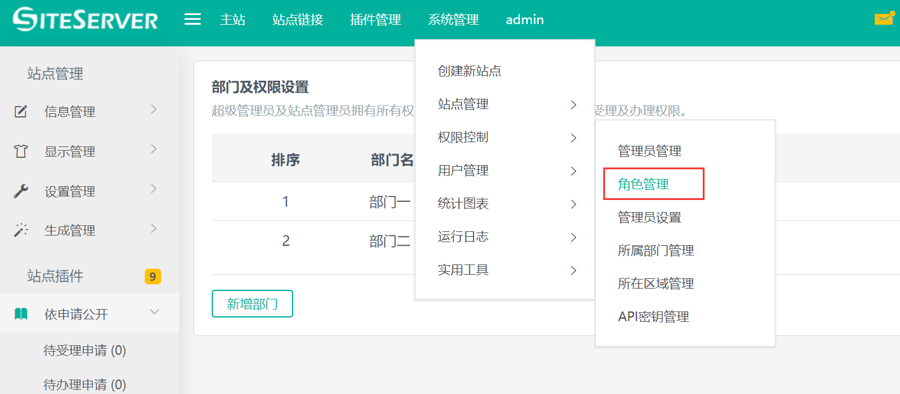
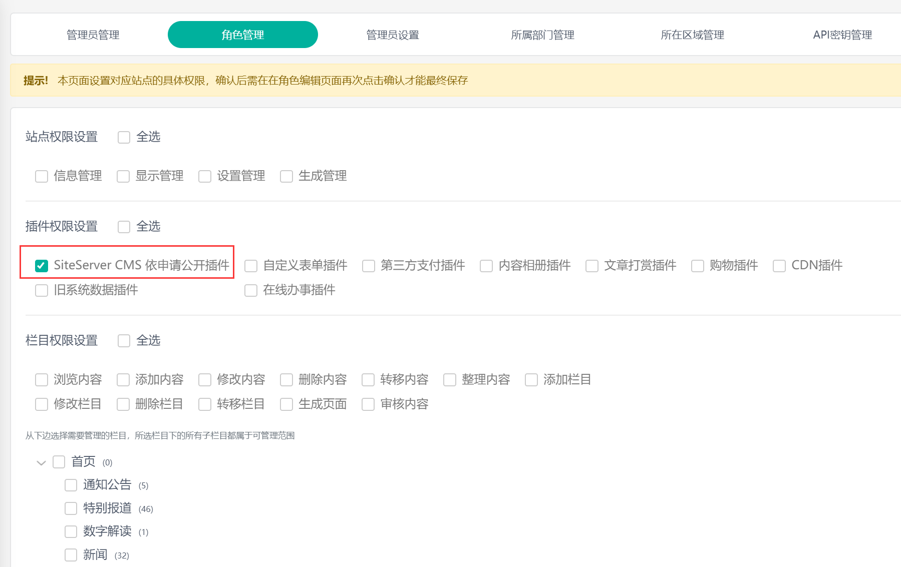

# 部门及权限设置

互动交流插件可以添加部门并指定部门的管理员，设置好部门及关联管理员后，管理员在进入互动交流系统后将只能办理属于自己部门的信件。

SiteServer CMS 有三种级别的管理员：普通管理员、站点管理员以及超级管理员；属于具体部门的管理员只能是普通管理员，站点管理员或者超级管理员可以处理所有信件，转办信件至指定部门以及最终审核并发布信件回复。

## 添加部门

在部门及权限设置界面点击新增部门按钮，进入添加部门界面：

在此可以设置部门名称、部门排序以及部门关联的管理员。

部门排序用于设置部门的显示顺序，部门排序越低，部门显示的位置越靠前。

部门管理员选项将列出系统中的所有普通管理员，需要注意的是，即使在此选择了对应的管理员，此管理员登录后也未必能有显示互动交流菜单，需要在后台权限控制菜单中将此管理员分配对应站点的互动交流权限。

站点管理员以及超级管理员默认拥有互动交流插件的所有权限，所以无法设置具体部门。

## 分配管理员互动交流插件权限

在部门添加界面选择了指定管理员后，需要在后台权限控制菜单中将此管理员分配对应站点的互动交流权限。

使用超级管理员登录 SiteServer CMS 系统，进入`系统管理` -> `权限控制` -> `角色管理`：

在角色权限设置界面中进入对应的站点，在插件权限设置选项中勾选`SiteServer CMS 互动交流插件`：

保存角色后将此角色分配给对应的管理员，管理员登录系统后将看到互动交流菜单并拥有对应的部门权限。
