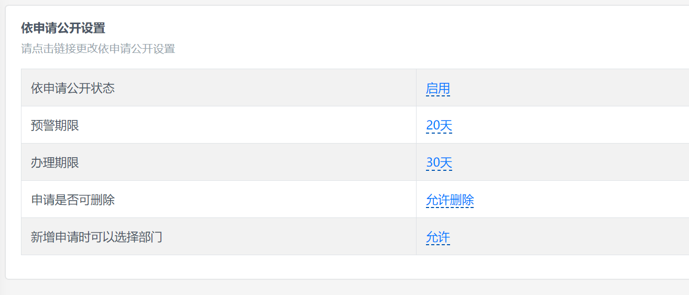

# 互动交流设置

开始使用互动交流之前，需要设置插件选项。

## 互动交流状态

互动交流默认为开启状态，如果设置为关闭状态，信件提交界面将显示关闭信息：

## 预警期限与办理期限

预警期限默认为 20 天，办理期限默认为 30 天，如果接近或者到达预警及办理期限，信件在后台列表中将根据信件提交时间显示不同的预警色及办理提醒。

如果不希望出现办理提醒，可以将预警期限或办理期限设置为 0。

## 信件是否可删除

信件是否可删除用于控制后台管理员是否有权限删除信件，默认为可删除状态，如果设置为不可删除，互动交流管理员将无法删除信件。

## 新增信件时可以选择部门

新增信件时可以选择部门选项用于前台互动交流表单提交界面是否出现部门选择项，默认是允许状态，用户可以在提交时选择互动交流的处理部门。

无论前台用户提交信件时是否选择处理部门，后台管理员均可以根据实际情况在办理信件时候转办信件至其他部门。
