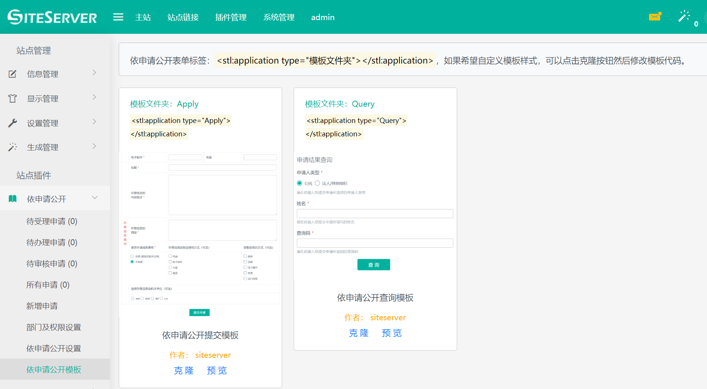
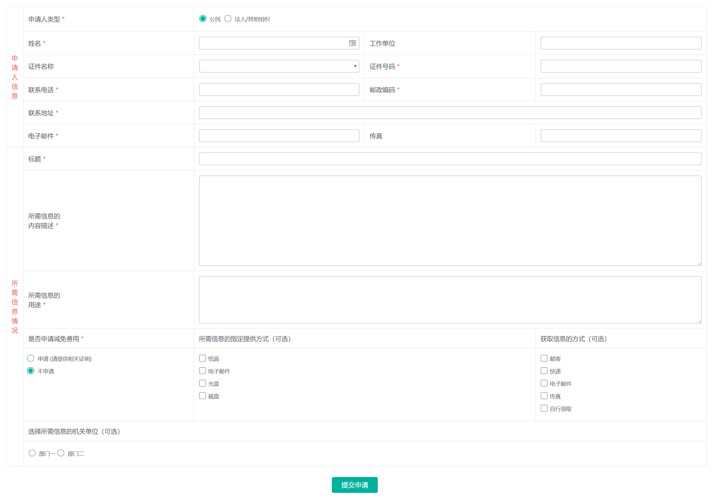
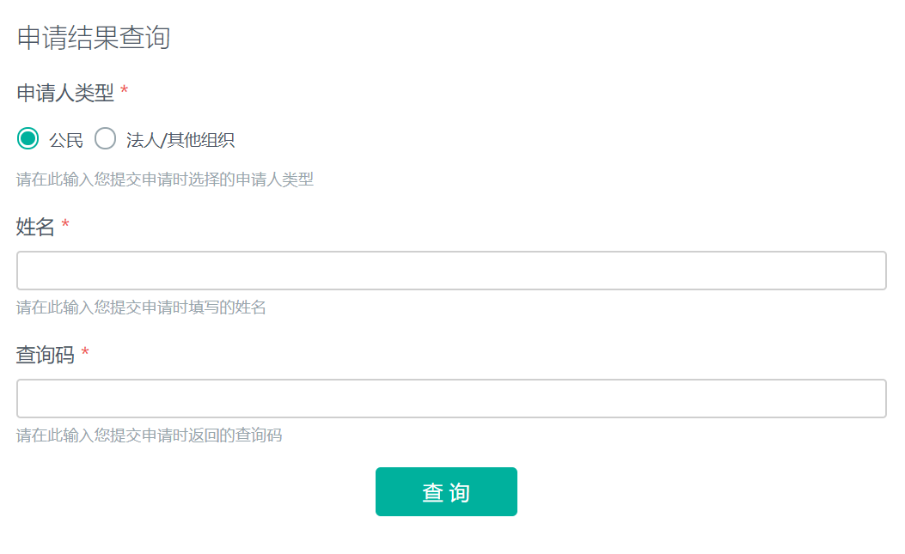
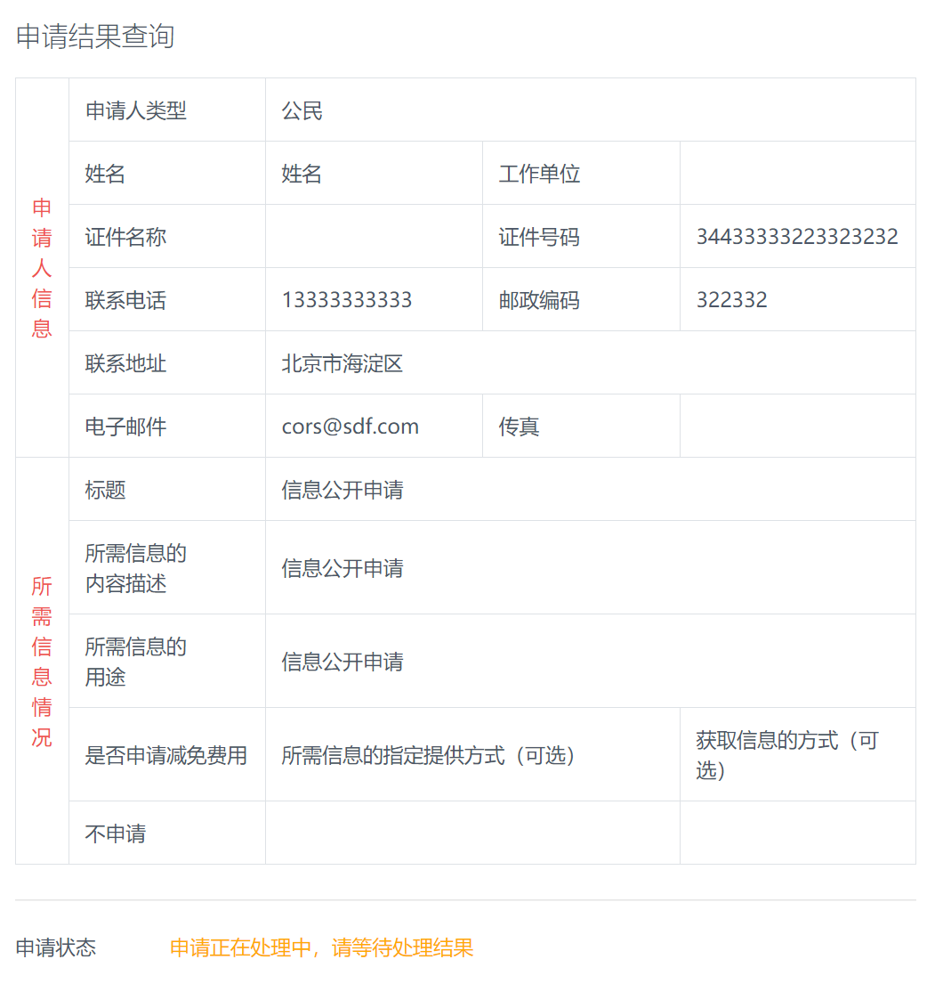
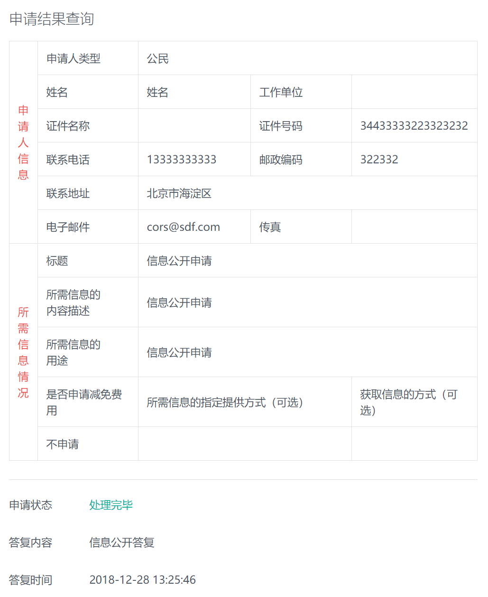

# 互动交流模板

进入互动交流插件，点击互动交流模板菜单，出现互动交流模板界面：



系统带有两个默认模板，分别用于前台页面提交信件以及前台页面查询信件办理结果使用。

## 信件提交标签

互动交流提交标签为：

```html
<stl:govInteract type="Apply"></stl:govInteract>
```

将标签放到模板并生成页面后将看到互动交流提交表单：



## 信件结果查询标签

互动交流查询标签为：

```html
<stl:govInteract type="Query"></stl:govInteract>
```

将标签放到模板并生成页面后将看到互动交流查询表单：



输入姓名与查询号点击查询按钮，如果信件正在办理中，界面将显示信件内容以及信件状态：



如果信件已被拒绝办理或者信件已经办理完成并通过信件，界面将显示信件内容、状态以及回复信息：


